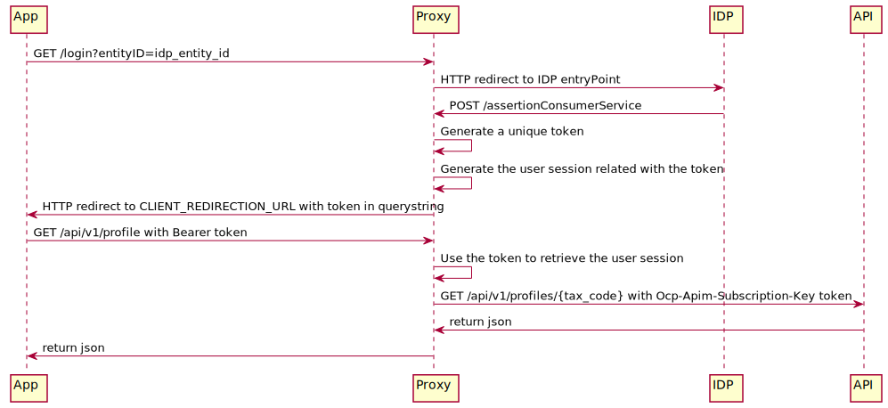

[](https://dev.azure.com/pagopa-io/io-backend/_build?definitionId=8&_a=summary)

[](https://www.codacy.com/app/cloudify/io-backend?utm_source=github.com&amp;utm_medium=referral&amp;utm_content=pagopa/io-backend&amp;utm_campaign=Badge_Grade)

[](https://codecov.io/gh/pagopa/io-backend)

# IO mobile backend

This repository contains the code of the backend used by the
[mobile](https://github.com/pagopa/io-app) applications of the [IO project](https://io.italia.it).

## Table of content

- [IO mobile backend](#io-mobile-backend)
  - [Table of content](#table-of-content)
  - [What is this?](#what-is-this)
  - [Authentication process](#authentication-process)
    - [User authentication](#user-authentication)
    - [Token authentication](#token-authentication)
  - [How to run the application](#how-to-run-the-application)
    - [Dependencies](#dependencies)
    - [Installation steps](#installation-steps)
    - [Container description](#container-description)
    - [Environment variables](#environment-variables)
    - [Logs](#logs)
    - [SPID user management](#spid-user-management)
  - [API Monitoring](#api-monitoring)
  - [Redis Database](#redis-database)
    - [Data Structure](#data-structure)
  - [Mobile App compatibility](#mobile-app-compatibility)
    - [Backend](#backend)
    - [PagoPa](#pagopa)
  - [How to contribute](#how-to-contribute)
    - [Dependencies](#dependencies-1)
    - [Starting steps](#starting-steps)
    - [Generate SAML (SPID) certs (development)](#generate-saml-spid-certs-development)
    - [Generate SAML (SPID) certs (production)](#generate-saml-spid-certs-production)
    - [SAML (SPID) certs with ENV vars](#saml-spid-certs-with-env-vars)
    - [SPID Identity Providers Metadata](#spid-identity-providers-metadata)
    - [SPID Validator](#spid-validator)
    - [Architecture decision records](#architecture-decision-records)
  - [Troubleshooting](#troubleshooting)

---

## What is this?

This is the backend that supports the [io-app](https://github.com/pagopa/io-app)
mobile application.

This project is part of the Italian Digital Citizenship initiative, see the
[main repository](https://github.com/pagopa/io) for further information.

## Authentication process

The `io-app` application will authenticate to the backend in two steps:

  1. an initial user initiated SPID authentication process (SAML2 based)
     that identifies the user and, on success, triggers the creation of a new
     authentication session (associated to a session token)
  2. subsequent requests to the backend will be authenticated via a bearer session token



### User authentication

When a client (the mobile app or a browser) wants to login with the backend it will call the `/login` endpoint with the
IDP entityID as parameter in the query string. The backend will then builds an authorization URL and performs a redirect
to the chosen IDP. The authentication process will continue to the IDP website. If the authentication process ends with
success the IDP will redirect the client to an HTML page with a form that will auto-post itself to the
`/assertionConsumerService` endpoint with a SAMLResponse as an hidden field. The backend will parse and validate the
SAMLResponse to extract all the user attributes (fiscal code, first name, last name, email), then it will generates an
unique alphanumeric string as token and saves an User object to the `SessionStorage` service using the token as key.
Finally the backend will redirect the client to the value of the environment variable `CLIENT_REDIRECTION_URL` with the
token in the query string. The client must saves the token and use it in all API request.

The code that manage this flow are in the `io-spid-commons` package (more info
[here](https://github.com/pagopa/io-spid-commons)), and in the `src/strategies/spidStrategy.ts` and
`src/controllers/authenticationController.ts` files.

### Token authentication

All API requests sent by the client to the backend must have an `Authorization: Bearer` header with the value of the
token obtained from the SPID authentication process. The token is used to retrieve the User object from the
`SessionStorage` service.

The code that manage this flow are in the `src/strategies/bearerSessionTokenStrategy.ts` file.

## How to run the application

### Dependencies

* [Docker](https://www.docker.com/) and [Docker Compose](https://github.com/docker/compose)

To fully simulate the SPID authentication process we use the images provided by the
[spid-testenv2](https://github.com/italia/spid-testenv2) project.

A Linux/macOS environment is required at the moment.

### Installation steps

1. clone the project in a folder called `io-backend`
1. go to the project's folder
1. copy `.nprmc.example` to `.npmrc` and replace the `TOKEN` planceholder with
   your GitHub token (must have repo and packages scopes)
1. run `scripts/build-tools.sh` to build the `tools` Docker image
1. run `scripts/yarn.sh` to install backend dependencies
1. run `scripts/generate-proxy-api-models.sh` to generate the models defined in api_proxy.yaml and api_notifications.yaml
1. run `scripts/build.sh` to compile the Typescript files
1. run `scripts/generate-test-certs-task.sh` to create SAML (SPID) certificates
1. edit your `/etc/hosts` file by adding:

    ```
    127.0.0.1    spid-testenv2
    127.0.0.1    io-backend
    ```

1. copy `.env.example` to `.env` and fill the variables with your values
1. run `docker-compose up -d` to start the containers
1. point your browser to [https://io-backend/metadata](https://io-backend/metadata) and copy the source of the
    page to a new `testenv2/conf/sp_metadata.xml` file
1. run `docker-compose up -d` again to restart the containers
1. point your browser to [https://io-backend](https://io-backend)

If you are using Docker with a Docker Machine replace `localhost` with the IP of the Docker Machine
([More details here](https://docs.docker.com/machine/reference/ip/)).

### Container description

* `backend`: the backend Node application that serves the web and mobile applications
* `spid-testenv2`: the test IDP server

Nginx is reachable at [https://io-backend]() \
IDP is reachable at [https://spid-testenv2:8088]() \

### Environment variables

Those are all Environment variables needed by the application:

| Variable name                             | Description                                                                                          | type   |
|----------------------------------------   |-----------------------------------------------------------------------------------                   |--------|
| API_KEY                                   | The key used to authenticate to the io-functions-app API                                             | string |
| API_URL                                   | The io-functions-app URL                                                                             | string |
| API_BASE_PATH                             | The root path for the backend api endpoints                                                          | string |
| BACKEND_HOST                              | The absolute URL of the app service containing the FQDN                                              | string |
| BONUS_API_KEY                             | The key used to authenticate to the io-functions-bonus API                                           | string |
| BONUS_API_URL                             | The io-functions-bonus  URL                                                                          | string |
| BONUS_API_BASE_PATH                       | The root path for the backend bonus api endpoints                                                    | string |
| CGN_API_KEY                               | The key used to authenticate to the io-functions-cgn API                                             | string |
| CGN_API_URL                               | The io-functions-cgn  URL                                                                            | string |
| CGN_API_BASE_PATH                         | The root path for the backend cgn api endpoints                                                      | string |
| CLIENT_REDIRECTION_URL                    | (Optional)The path where the user will be redirected after a successful SPID login                   | string |
| PORT                                      | The HTTP port the Express server is listening to                                                     | int    |
| REDIS_URL                                 | The URL of a Redis instance                                                                          | string |
| TOKEN_DURATION_IN_SECONDS                 | The number of seconds a session token is considered valid                                            | int    |
| LV_TOKEN_DURATION_IN_SECONDS              | (Optional) The number of seconds a session token is considered valid if LV is enabled                | int    |
| SAML_CALLBACK_URL                         | The absolute URL of the assertion consumer service endpoint                                          | string |
| SAML_ISSUER                               | The issuer id for this Service Provider                                                              | string |
| SAML_ACCEPTED_CLOCK_SKEW_MS               | Maximum skew between SAML Client and Server (empty or -1 disable datetime checks)                    | int    |
| SAML_ATTRIBUTE_CONSUMING_SERVICE_INDEX    | The index in the attribute consumer list                                                             | int    |
| SAML_KEY                                  | Private Key used by SAML protocol                                                                    | string |
| SAML_CERT                                 | Certificate used by SAML protocol                                                                    | string |
| SAML_REQUEST_EXPIRATION_PERIOD_MS         | (Optional) The TTL in milliseconds that the SAML Request was stored in cache (defaults to `600.000`) | number |
| PRE_SHARED_KEY                            | The key shared with the API backend to authenticate the webhook notifications                        | string |
| ALLOW_NOTIFY_IP_SOURCE_RANGE              | The range in CIDR form of allowed IPs for the webhook notifications                                  | string |
| NOTIFICATIONS_STORAGE_CONNECTION_STRING   | Connection string to Azure queue storage for notification hub messages                               | string |
| NOTIFICATIONS_QUEUE_NAME                  | Queue name of Azure queue storage for notification hub messages                                      | string |
| USERS_LOGIN_STORAGE_CONNECTION_STRING     | Connection string to Azure queue storage for usersLogin messages                                     | string |
| USERS_LOGIN_QUEUE_NAME                    | Queue name of Azure queue storage for usersLogin messages                                            | string |
| ALLOW_PAGOPA_IP_SOURCE_RANGE              | The range in CIDR form of allowed IPs for the PagoPA API                                             | string |
| ALLOW_MYPORTAL_IP_SOURCE_RANGE            | The range in CIDR form of allowed IPs for the MyPortal API                                           | string |
| ALLOW_BPD_IP_SOURCE_RANGE                 | The range in CIDR form of allowed IPs for the BPD API                                                | string |
| ALLOW_SESSION_HANDLER_IP_SOURCE_RANGE     | The range in CIDR form of IPs of service allowed to handle user sessions                             | string |
| AUTHENTICATION_BASE_PATH                  | The root path for the authentication endpoints                                                       | string |
| PAGOPA_API_URL_PROD                       | The url for the PagoPA api endpoints in prod mode                                                    | string |
| PAGOPA_API_KEY_PROD                       | The api-key needed to call the pagopa proxy API                                                      | string |
| PAGOPA_API_URL_TEST                       | The url for the PagoPA api endpoints in test mode                                                    | string |
| PAGOPA_API_KEY_UAT                        | The api-key needed to call the pagopa proxy API for UAT instance                                     | string |
| PAGOPA_BASE_PATH                          | The root path for the PagoPA endpoints                                                               | string |
| MYPORTAL_BASE_PATH                        | The root path for the MyPortal endpoints                                                             | string |
| BPD_BASE_PATH                             | The root path for the BPD endpoints                                                                  | string |
| FIMS_BASE_PATH                            | The root path for the FIMS endpoints                                                                 | string |
| STARTUP_IDPS_METADATA                     | Stringified JSON containing idps metadata `Record<string, string>`                                   | string |
| CIE_METADATA_URL                          | Url to download CIE metadata from                                                                    | string |
| IDP_METADATA_URL                          | Url to download SPID IDPs metadata from                                                              | string |
| SPID_TESTENV_URL                          | Url to SPID Testenv 2                                                                                | string |
| SPID_VALIDATOR_URL                        | Url to SPID Validator                                                                                | string |
| IDP_METADATA_REFRESH_INTERVAL_SECONDS     | The number of seconds when the IDPs Metadata are refreshed                                           | int    |
| CACHE_MAX_AGE_SECONDS                     | The value in seconds for duration of in-memory api cache                                             | int    |
| APICACHE_DEBUG                            | When is `true` enable the apicache debug mode                                                        | boolean |
| GITHUB_TOKEN                              | The value of your Github Api Key, used in build phase                                                | string |
| FETCH_KEEPALIVE_ENABLED                   | When is `true` enables `keepalive` agent in the API client (defaults to `false`)                     | boolean |
| ENABLE_NOTICE_EMAIL_CACHE                 | (Optional) Enable `notice_email` cache in PagoPA getUser (defaults to `false`)                       | boolean |
| SPID_LEVEL_WHITELIST                      | (Optional) Spid Level whitelist csv (defaults L2 and L3 for prod, all for dev)                       | string |
| TEST_LOGIN_FISCAL_CODES                   | (Optional) Enabled username for password based login (coma separated Fiscal Code)                    | string |
| TEST_LOGIN_PASSWORD                       | (Optional) Password for password based login                                                         | string |
| FETCH_KEEPALIVE_MAX_SOCKETS               | (Optional) See [agentkeepalive](https://github.com/node-modules/agentkeepalive#readme)               | |
| FETCH_KEEPALIVE_FREE_SOCKET_TIMEOUT_MS    | (Optional) See [agentkeepalive](https://github.com/node-modules/agentkeepalive#readme)               | |
| FETCH_KEEPALIVE_KEEPALIVE_MSECS           | (Optional) See [agentkeepalive](https://github.com/node-modules/agentkeepalive#readme)               | |
| FETCH_KEEPALIVE_MAX_FREE_SOCKETS          | (Optional) See [agentkeepalive](https://github.com/node-modules/agentkeepalive#readme)               | |
| FETCH_KEEPALIVE_TIMEOUT                   | (Optional) See [agentkeepalive](https://github.com/node-modules/agentkeepalive#readme)               | |
| FETCH_KEEPALIVE_SOCKET_ACTIVE_TTL         | (Optional) See [agentkeepalive](https://github.com/node-modules/agentkeepalive#readme)               | |
| FF_CGN_ENABLED                            | When is `true` (namely `1`) enables CGN API to be registered into backend app                        | boolean |
| FF_CGN_ENABLED                            | When is `true` (namely `1`) enables CGN API to be registered into backend app                        | boolean |
| APP_MESSAGES_API_KEY                      | The key used to authenticate to the io-functions-app-messages API                                    | string |
| APP_MESSAGES_API_URL                      | The io-functions-app-messages URL                                                                    | string |
| THIRD_PARTY_CONFIG_LIST                   | (Optional, default empty) A list of ThirdParty Configuration                                         | stringified JSON |
| IS_APPBACKENDLI                           | (Optional, default false) Enables notify and session lock endpoints working only on appbackendli     | boolean |
| FF_PN_ACTIVATION_ENABLED                  | (Optional) Enable the integration with PN for Service Activation (1 enabled)                         | int     |
| PN_ACTIVATION_BASE_PATH                   | (Required if FF_PN_ACTIVATION_ENABLED = 1) base path for activation endpoint                         | string  |
| PN_API_KEY                                | (Required if FF_PN_ACTIVATION_ENABLED = 1) PN API key for production environment                     | string  |
| PN_API_KEY_UAT                            | (Required if FF_PN_ACTIVATION_ENABLED = 1) PN API key for UAT environment                            | string  |
| PN_API_URL                                | (Required if FF_PN_ACTIVATION_ENABLED = 1) PN API base url for production                            | string  |
| PN_API_URL_UAT                            | (Required if FF_PN_ACTIVATION_ENABLED = 1) PN API base url for UAT environment                       | string  |
| FF_IO_SIGN_ENABLED                        | When is `true` (namely `1`) enables IO SIGN API to be registered into backend app                    | boolean |
| IO_SIGN_API_BASE_PATH                     | The root path for the backend io-sign api endpoints                                                  | string  |
| IO_SIGN_API_KEY                           | The key used to authenticate to the io-func-sign-user API                                            | string  |
| IO_SIGN_API_URL                           | The io-func-sign-user  URL                                                                           | string  |
| LOLLIPOP_API_KEY                          | The key used to authenticate to the io-function-lollipop API                                         | string  |
| LOLLIPOP_API_URL                          | The io-function-lollipop URL                                                                         | string  |
| LOLLIPOP_API_BASE_PATH                    | The io-function-lollipop api base path                                                               | string  |
| FF_LOLLIPOP_ENABLED                       | (Optional) Enable Lollipop flows default false                                                       | boolean |
| LOLLIPOP_REVOKE_STORAGE_CONNECTION_STRING | Connection string to Azure queue storage for revoke Users lollipop PubKeys                           | string  |
| LOLLIPOP_REVOKE_QUEUE_NAME                | Queue name of Azure queue storage for revoke Users lollipop PubKeys                                  | string  |
| FF_FAST_LOGIN                             | (Optional) Enable Fast Login flow. Default: NONE                                                     | string (enum) |
| LV_TEST_USERS                             | (Optional) Comma separated list of LV beta testers. Default: empty array                             | srting |

Notes:

 * `FETCH_KEEPALIVE_ENABLED` should be enabled when deploying on Azure App Service to avoid [SNAT Exhaustion](https://docs.microsoft.com/en-us/azure/load-balancer/load-balancer-outbound-connections)
 * `FETCH_KEEPALIVE_MAX_SOCKETS` depends on the number of `node` processes running on the VM, see [this article](https://docs.microsoft.com/en-us/azure/app-service/app-service-web-nodejs-best-practices-and-troubleshoot-guide#my-node-application-is-making-excessive-outbound-calls) and [this issue](https://github.com/MicrosoftDocs/azure-docs/issues/8013)
 * `FETCH_KEEPALIVE_SOCKET_ACTIVE_TTL` should be set at around 100 seconds when deploying on Azure, see [this comment](https://github.com/MicrosoftDocs/azure-docs/issues/29600#issuecomment-490354812)

If you are trying to run the docker images on your local environment (through the docker-compose) you must set the following variables:
  * SPID_LOG_STORAGE_CONNECTION_STRING
  * NOTIFICATIONS_STORAGE_CONNECTION_STRING
  * PUSH_NOTIFICATIONS_STORAGE_CONNECTION_STRING
  * USERS_LOGIN_STORAGE_CONNECTION_STRING
  * LOLLIPOP_REVOKE_STORAGE_CONNECTION_STRING
With this **connection string** as value:
  * DefaultEndpointsProtocol=http;AccountName=devstoreaccount1;AccountKey=Eby8vdM02xNOcqFlqUwJPLlmEtlCDXJ1OUzFT50uSRZ6IFsuFq2UVErCz4I6tq/K1SZFPTOtr/KBHBeksoGMGw==;BlobEndpoint=http://127.0.0.1:20003/devstoreaccount1;QueueEndpoint=http://127.0.0.1:20004/devstoreaccount1;TableEndpoint=http://127.0.0.1:20005/devstoreaccount1;

The **connection string** has a default value needed to connect to Azurite, a local emulator used to provide a free local environment for testing an Azure Blob, Queue Storage, and Table Storage application.
As for docker-compose instructions, the Azurite docker image runs the Blob service on port 20003, the Queue service on port 20004 and the Table service on port 20005. If Azurite is executed on different address or ports, the **connection string** must be changed according to the service.

You must also set the following variables:
 * REDIS_URL
 * REDIS_PORT
 * REDIS_PASSWORD

With the same values defined in the docker-compose.yml file.

### Logs

Application logs are saved into the logs folder.

### SPID user management

The setup procedure adds some test users to the test IDP server, the full list could be retrieved in
`testenv2/conf/users.json`. To add more users simply add more items to this file and restart the `spid-testenv2`
container.

---

## API Monitoring

Is possible link the API to AppInsignts service by setting the ENV variable `APPINSIGHTS_INSTRUMENTATIONKEY`. Stats of API CPU and RAM usage, API call execution time, success or failure of API calls are collected.
Realtime data collection is enabled.

## Redis Database

### Data Structure

Redis Database stores data required only by application side functionalities. Below a table with an example of data for an hypothetical user with fiscal code `MRARSS80A01H501T` and with session token `HexToken`.


| Key                          | Value                                                              | type   | expire in |
|----------------------------------------|-----------------------------------------------------------------------------------|--------|-----------|
| SESSION-HexToken       | a JSON representing the user object | `User` | TOKEN_DURATION_IN_SECONDS |
| WALLET-WalletHexToken   | `"SESSION-HexToken"` | `String` | TOKEN_DURATION_IN_SECONDS |
| SESSIONINFO-HexToken   | a JSON representing the `SessionInfo` object | `SessionInfo` | TOKEN_DURATION_IN_SECONDS |
| USERSESSIONS-MRARSS80A01H501T | a Set of SessionInfo Keys | `Set<SessionInfoKey>` | never |

## Mobile App compatibility

### Backend

To handle Backend compatibility with several Mobile App versions, the oldest mobile app version supported by the backend is stored into the property `min_app_version` inside the `package.json`. This value is provided to the app through the `/info` API.
If the mobile app version is lower an upgrade is required.

### PagoPa

To handle the mobile app compatibility with the latest implementation of PagoPA APIs, the backend exposes through the `/info` API a property called `min_app_version_pagopa` defined into `package.json` file. If the mobile app version is lower of this value, all the functions that require PagoPa are disabled to avoid compatibility issues.

## How to contribute

### Dependencies

* [nodenv](https://github.com/nodenv/nodenv)
* [YARN](https://yarnpkg.com/)
* [Docker](https://www.docker.com/community-edition) (optional)

A Linux/macOS environment is required at the moment.

### Starting steps

* use `nodenv` to run the correct version of Nodejs as specified in `app/.node-version`
* run Jest tests directly or with `scripts/test.sh`

In general follow the [Node Best Practices](https://devcenter.heroku.com/articles/node-best-practices).

### Generate SAML (SPID) certs (development)

The backend implements a SAML Service Provider - for authenticating the clients
it needs a certificate that you can generate with the following command
(you need to have `openssl` available in your path):

```
$ yarn generate:test-certs
```

### Generate SAML (SPID) certs (production)

For production, the SPID certificate must be generated with
the following command:

```
$ openssl req -x509 -nodes -sha256 -days 365 -newkey rsa:4096 -keyout key.pem -out cert.pem
```

Then, the key and the certificate must be stored in the
Kubernetes secrets:

```
$ kubectl create secret generic spid-cert --from-file=./cert.pem --from-file=./key.pem
```

### SAML (SPID) certs with ENV vars

The certificate and the secret key could be provided to the backend with two ENV variables:
- `SAML_KEY`
- `SAML_CERT`

if these variables are set `cert.pem` and `key.pem` are ignored.

### SPID Identity Providers Metadata

When backend starts, SPID login is configured with Identity Providers metadata fetched from remote URL. URLs are provided by the following Environment variables: `CIE_METADATA_URL` (CIE login) `IDP_METADATA_URL` (SPID login) and `SPID_TESTENV_URL` (SPID test environment). Before that the backend become ready a time consuming operation must be completed (fetching remote metadata).

The default values are explained into the following table

| ENV                                    | development                                                                                   | production                                                       |
|----------------------------------------|-----------------------------------------------------------------------------------------------|------------------------------------------------------------------|
| `IDP_METADATA_URL`                     | https://registry.spid.gov.it/metadata/idp/spid-entities-idps.xml                              |   https://api.is.eng.pagopa.it/idp-keys/spid/latest                |
| `CIE_METADATA_URL`                     | https://preproduzione.idserver.servizicie.interno.gov.it/idp/shibboleth?Metadata              |   https://api.is.eng.pagopa.it/idp-keys/cie/latest |
| `SPID_TESTENV_URL`                     | https://spid-testenv2:8088                                                                    | -                                                                |

For local development only, spid-testenv2 (executed with docker-compose) could be used to login with a (fake) SPID account.

On production, in order to reduce the startup time, another Environment variable could be provided  `STARTUP_IDPS_METADATA`. To set its value run:
```bash
export STARTUP_IDPS_METADATA=`npx startup-idps-metadata --idp-metadata-url-env IDP_METADATA_URL --cie-metadata-url-env CIE_METADATA_URL`
```

### SPID Validator

If is needed SPID validation another available environment variable is `SPID_VALIDATOR_URL`. Valid values for `SPID_VALIDATOR_URL` are:

| ENV                                    | development                            | production                    |
|----------------------------------------|----------------------------------------|-------------------------------|
| `IDP_METADATA_URL`                     | http://spid-saml-check:8080            | https://validator.spid.gov.it |

Spid Validator is a tool that verify that the SPID implementation is compliant with the AGID specification.

### Architecture decision records

In a world of evolutionary architecture, it's important to record certain design decisions for the benefit of future
team members as well as for external oversight. Architecture Decision Records is a technique for capturing important
architectural decisions along with their context and consequences. We store these details in source control, along with
code, as then they can provide a record that remains in sync with the code itself.

We use
[ADR](http://thinkrelevance.com/blog/2011/11/15/documenting-architecture-decisions)s to track architectural decisions of
this initiative.

This repository is configured for Nat Pryce's [_adr-tools_](https://github.com/npryce/adr-tools).

Here's the decisions we taken so far:

| ADR | Title                                                                                                                             | PR (discussion)    |
| --- | --------------------------------------------------------------------------------------------------------------------------------- | ------------------ |
| 1   | [Record architecture decisions](doc/architecture/decisions/0001-record-architecture-decisions.md)                                 |                    |
| 2   | [Backend runs on Docker on local environments](doc/architecture/decisions/0002-backend-runs-on-docker-on-local-environments.md)   |                    |
| 3   | [Use OpenAPI to defined the API specs](doc/architecture/decisions/0003-use-openapi-to-defined-the-api-specs.md)                   |                    |
| 4   | [Use a dependency injection container](doc/architecture/decisions/0004-use-a-dependency-injection-container.md)                   |                    |
| 5   | [Use a GUID as Installation ID](doc/architecture/decisions/0005-use-a-guid-as-installation-id.md)                                 |                    |
| 6   | [Backend is deployed on more than one instance](doc/architecture/decisions/0006-backend-is-deployed-on-more-than-one-instance.md) |                    |

---

## Troubleshooting

**I installed on my mac but seems that https://io-backend is not working (ping io-backend return a host error)**

Check out /etc/hosts
Remember that in some cases you need to use your docker-machine ip (get it from >docker-machine ip) instead of
localhost.

**I followed all the steps but when i go to https://io-backend it shows me the same as https://io-backend:8080**

This problem seems to be dependent on how Docker for Mac (doesn't) manage well the /etc/hosts file. If you install
Docker Toolbox it works fine (and can [coexist](https://docs.docker.com/docker-for-mac/docker-toolbox/#setting-up-to-run-docker-for-mac))
(Read more at [https://medium.com/@itseranga/set-hosts-in-docker-for-mac-2029276fd448](https://medium.com/@itseranga/set-hosts-in-docker-for-mac-2029276fd448))
